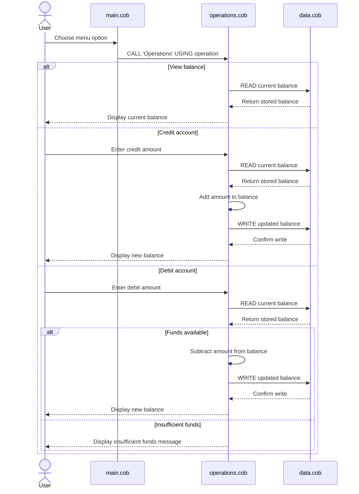

# COBOL Account Management Documentation

This directory documents the legacy COBOL sample used to model a simple account-management workflow.

## File overview

### `src/cobol/main.cob`
Purpose:
- Acts as the main entry point for the program.
- Presents the user with a menu for account operations.
- Dispatches requests to the `Operations` program based on the user’s selection.

Key functions:
- Displays the account menu.
- Accepts a numeric choice from the user.
- Uses `EVALUATE` to route requests to:
  - `TOTAL ` for viewing the current balance
  - `CREDIT` for adding money
  - `DEBIT ` for subtracting money
  - `4` to exit the program

Notes:
- The menu loop continues until the user explicitly enters `4`.
- Any other numeric input prints an invalid-choice message.

### `src/cobol/operations.cob`
Purpose:
- Contains the business-logic workflow for account actions.
- Handles the account operations requested by `main.cob`.

Key functions:
- `TOTAL `: reads the stored balance and prints it.
- `CREDIT`: prompts the user for an amount, reads the current balance, adds the incoming amount, writes the updated balance, and displays the new value.
- `DEBIT `: prompts the user for an amount, reads the current balance, subtracts the amount only if enough funds exist, writes the updated balance back, and displays the result.

Important validation behavior:
- A debit is only allowed when the current balance is greater than or equal to the requested debit amount.
- If funds are insufficient, the program prints: `Insufficient funds for this debit.`

### `src/cobol/data.cob`
Purpose:
- Provides the data-access-style read/write layer used by the operations logic.
- Stores the balance value in working storage for the life of the program run.

Key functions:
- `READ`: copies the stored balance into the calling program’s balance field.
- `WRITE`: copies the updated balance back into the internal storage field.

Notes:
- The storage balance starts at `1000.00`.
- This acts like a tiny in-memory persistence model rather than a database-backed system.

## Student-account business rules implied by the code

Although the sample does not contain explicit fields such as `student-id`, `major`, or `enrollment-status`, the logic reflects a simple account rule set that could apply to a student account workflow:

1. Every account starts with a default balance of `1000.00`.
2. The account holder can inspect the current balance.
3. The account holder can add funds to the balance through a credit operation.
4. The account holder can withdraw funds through a debit operation.
5. Debit operations must not create a negative balance.
6. The programs enforce a basic overdraft protection rule:
   - if `balance < amount`, the transaction is rejected.
7. All account updates are kept in memory for the current runtime session and not persisted to a permanent data store.

## Summary

This COBOL sample is a small, procedural account-management system with:
- a menu-driven interface,
- a logic layer for credit/debit/total operations,
- and a simple in-memory balance store.

The strongest business rules in the codebase are:
- default opening balance is `1000.00`,
- debits are blocked when funds are insufficient,
- and the balance is updated centrally through the `DataProgram` routine.

## Sequence diagram

